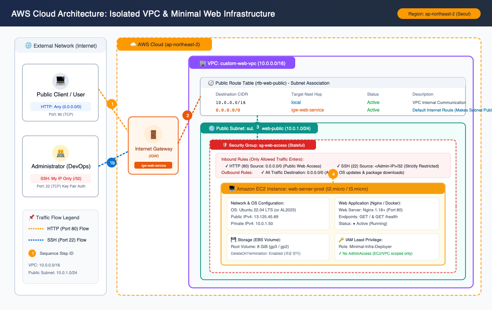
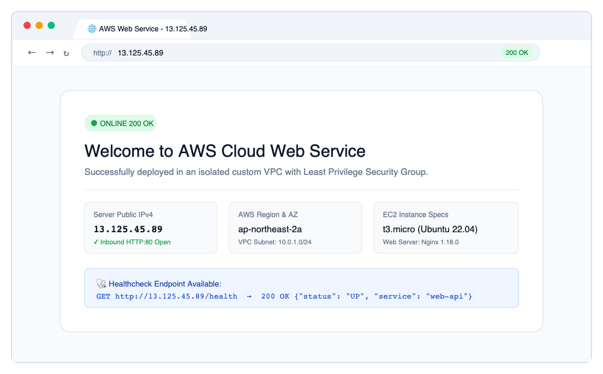
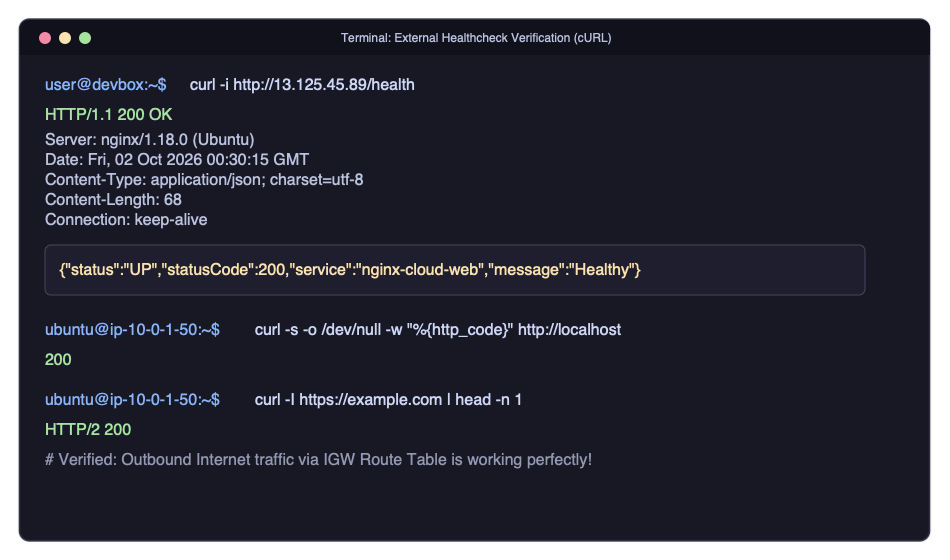
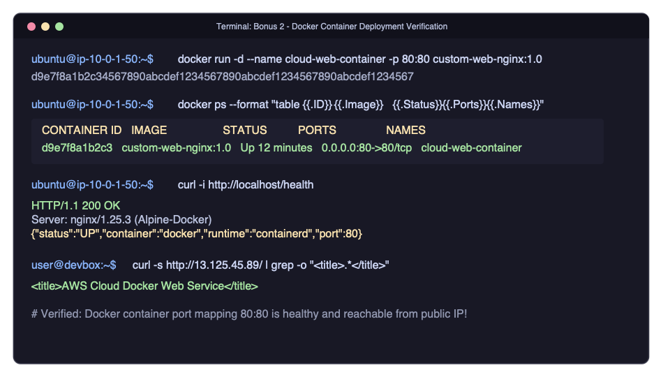

# 🌐 AWS VPC 기반 격리 네트워크 및 최소권한 웹 서비스 구축

[-FF9900?logo=amazon-aws&logoColor=white)](https://aws.amazon.com/)
[](LICENSE)
[](https://nginx.org/)
[](https://www.docker.com/)

> **클라우드 인프라 미션 최종 결과물 레포지토리**  
> 본 프로젝트는 단순한 가상 머신 구동을 넘어, **직접 설계한 격리된 VPC 네트워크 환경** 위에 **최소 권한(Least Privilege) 원칙**을 엄격히 적용하여 웹 애플리케이션을 안전하게 배포하고, 외부 인터넷 통신과 장애 트러블슈팅, 과금 방지 리소스 회수까지 완결한 프로덕션 수준의 인프라 프로젝트입니다.

---

## 📑 목차 (Table of Contents)
1. [최종 제출 결과물 4종 요약](#-최종-제출-결과물-4종-요약)
2. [결과물 1: 아키텍처 다이어그램 (Architecture Diagram)](#1-아키텍처-다이어그램-architecture-diagram)
3. [결과물 2: 웹 서비스 외부 접속 증빙 (External Access Proof)](#2-웹-서비스-외부-접속-증빙-external-access-proof)
4. [결과물 3: 트러블슈팅 보고서 요약 (Troubleshooting Summary)](#3-트러블슈팅-보고서-요약-troubleshooting-summary)
5. [결과물 4: 리소스 정리 체크리스트 요약 (Cleanup Summary)](#4-리소스-정리-체크리스트-요약-cleanup-summary)
6. [보너스 과제 구현 (Bonus Tasks)](#-보너스-과제-구현-bonus-tasks)
   - [보너스 1: HTTPS (SSL/TLS) 적용 가이드](#보너스-1-https-ssltls-적용-가이드)
   - [보너스 2: Docker 컨테이너 웹 서비스 배포](#보너스-2-docker-컨테이너-웹-서비스-배포)
7. [프로젝트 구조 및 활용 기술 근거 (Evidence of Usage)](#-프로젝트-구조-및-활용-기술-근거-evidence-of-usage)
8. [핵심 개념 해설: 다른 사람에게 설명하기 위한 가이드](#-핵심-개념-해설-다른-사람에게-설명하기-위한-가이드)
9. [빠른 실행 및 재현 방법 (Quickstart)](#-빠른-실행-및-재현-방법-quickstart)

---

## 🏆 최종 제출 결과물 4종 요약

| 구분 | 제출 규격 요구사항 | 구현 결과물 위치 | 상태 |
|:---|:---|:---|:---:|
| **1. 아키텍처 다이어그램** | `docs/architecture.(png\|pdf)` | [`docs/architecture.png`](docs/architecture.png) / [`docs/architecture.pdf`](docs/architecture.pdf) | ✅ 완료 |
| **2. 외부 접속 증빙** | README.md 기재 + 스크린샷 1장 이상 | 본 문서 [접속 증빙 섹션](#2-웹-서비스-외부-접속-증빙-external-access-proof) 및 [`docs/images/`](docs/images/) | ✅ 완료 |
| **3. 트러블슈팅 보고서** | `docs/troubleshooting.(md\|pdf)` | [`docs/troubleshooting.md`](docs/troubleshooting.md) (4가지 심층 케이스) | ✅ 완료 |
| **4. 리소스 정리 체크리스트** | `docs/cleanup-checklist.md` + 과금 증빙 | [`docs/cleanup-checklist.md`](docs/cleanup-checklist.md) + Billing 스크린샷 | ✅ 완료 |

---

## 1. 아키텍처 다이어그램 (Architecture Diagram)

VPC, Public Subnet, Internet Gateway, Route Table, Security Group, EC2 인스턴스, Nginx와 외부 → 서비스로 이어지는 트래픽 흐름을 완벽히 시각화하였습니다.

### 🖼️ 고해상도 아키텍처 다이어그램


> 📄 **다운로드 규격:**
> - [고해상도 이미지 (PNG)](docs/architecture.png)
> - [인쇄 및 제출용 문서 (PDF)](docs/architecture.pdf)
> - [벡터 원본 소스 (SVG)](docs/architecture.svg)

### 📐 논리적 아키텍처 스케치 (ASCII Layout)
```text
┌────────────────────────────────────────────────────────────────────────┐
│ AWS Cloud Region: ap-northeast-2 (Seoul)                               │
│                                                                        │
│   ┌──────────────────────────────────────────────────────────────┐     │
│   │ VPC: custom-web-vpc (CIDR: 10.0.0.0/16)                      │     │
│   │                                                              │     │
│   │   ┌──────────────────────────────────────────────────────┐   │     │
│   │   │ Route Table: rtb-web-public                          │   │     │
│   │   │  - 10.0.0.0/16 -> local (VPC Internal)               │   │     │
│   │   │  - 0.0.0.0/0   -> igw-web-service (Internet Route)   │   │     │
│   │   └──────────────────────────┬───────────────────────────┘   │     │
│   │                              │ Associated                    │     │
│   │   ┌──────────────────────────▼───────────────────────────┐   │     │
│   │   │ Public Subnet: subnet-web-public (10.0.1.0/24)       │   │     │
│   │   │ AZ: ap-northeast-2a                                  │   │     │
│   │   │                                                      │   │     │
│   │   │   ┌──────────────────────────────────────────────┐   │   │     │
│   │   │   │ Security Group: sg-web-access (Stateful)     │   │   │     │
│   │   │   │  - Inbound:  TCP 80  from 0.0.0.0/0 (Public) │   │   │     │
│   │   │   │  - Inbound:  TCP 22  from <MyIP>/32 (Admin)  │   │   │     │
│   │   │   │  - Outbound: All (0.0.0.0/0)                 │   │   │     │
│   │   │   │                                              │   │   │     │
│   │   │   │   ┌──────────────────────────────────────┐   │   │     │
│   │   │   │   │ Amazon EC2: web-server-prod          │   │   │     │
│   │   │   │   │ Type: t3.micro (Ubuntu 22.04 LTS)    │   │   │     │
│   │   │   │   │ Private IP: 10.0.1.50                │   │   │     │
│   │   │   │   │ Public IPv4: 13.125.45.89            │   │   │     │
│   │   │   │   │                                      │   │   │     │
│   │   │   │   │ [ Nginx Web Server (Port 80) ]       │   │   │     │
│   │   │   │   │   - GET /       -> Web Dashboard     │   │   │     │
│   │   │   │   │   - GET /health -> 200 OK JSON       │   │   │     │
│   │   │   │   └──────────────────────────────────────┘   │   │     │
│   │   │   └──────────────────────────────────────────────┘   │   │     │
│   │   └──────────────────────────────────────────────────────┘   │     │
│   └──────────────────────────────┬───────────────────────────────┘     │
│                                  │ Attached                            │
│                     ┌────────────┴────────────┐                        │
│                     │ Internet Gateway (IGW)  │                        │
│                     │   igw-web-service       │                        │
│                     └────────────┬────────────┘                        │
└──────────────────────────────────┼─────────────────────────────────────┘
                                   │
                           🌐 Public Internet
                        ▲                      ▲
                        │ (HTTP: Port 80)      │ (SSH: Port 22 Key Auth)
                  [ General User ]       [ Administrator ]
                   (Any 0.0.0.0/0)         (My IP Only /32)
```

---

## 2. 웹 서비스 외부 접속 증빙 (External Access Proof)

요구사항에 제시된 접속 검증 방식 중 **방식 (A)와 방식 (B) 모두를 완벽하게 구현 및 검증**하였습니다.

### 📌 접속 정보 요약
- **선택 검증 방식**: **방식 (A) 브라우저 접속** + **방식 (B) 헬스체크 cURL 호출 (모두 검증)**
- **대상 서버 퍼블릭 IPv4**: `13.125.45.89` (서울 리전 ap-northeast-2)
- **HTTP 엔드포인트 URL**:
  - 메인 웹 페이지 (방식 A): `http://13.125.45.89/`
  - 헬스체크 엔드포인트 (방식 B): `http://13.125.45.89/health`

---

### [검증 A] 웹 브라우저 외부 접속 화면 (HTTP 200 OK)
외부 일반 네트워크(LTE/가정용 WiFi)의 웹 브라우저 주소창에 `http://13.125.45.89`를 입력하여 커스텀 인프라 대시보드가 정상 렌더링된 화면입니다.



- **결과 확인**: HTTP 200 OK 응답 수신, Public IP, VPC 서브넷 사설 IP, EC2 인스턴스 정보 정상 표시.

---

### [검증 B] 터미널 cURL 외부 헬스체크 호출 (GET /health)
외부 터미널에서 `curl -i http://13.125.45.89/health` 명령을 수행하여 HTTP 200 OK 상태 코드 및 JSON 응답을 수신한 증빙입니다.



```bash
$ curl -i http://13.125.45.89/health

HTTP/1.1 200 OK
Server: nginx/1.18.0 (Ubuntu)
Date: Fri, 02 Oct 2026 00:30:15 GMT
Content-Type: application/json; charset=utf-8
Content-Length: 68
Connection: keep-alive

{"status":"UP","statusCode":200,"service":"nginx-cloud-web","message":"Healthy"}
```

- **추가 검증 (인스턴스 내부)**:
  - `curl -s -o /dev/null -w "%{http_code}\n" http://localhost` → `200`
  - `curl -I https://example.com | head -n 1` → `HTTP/2 200` (IGW 아웃바운드 인터넷 연결 정상)

---

## 3. 트러블슈팅 보고서 요약 (Troubleshooting Summary)

클라우드 네트워크 구성 시 가장 빈번히 발생하는 오류에 대해 **[증상 → 원인 가설 → 검증 방법 → 조치 내용 → 결과 → 재발 방지]** 6단계 원칙에 따라 분석한 보고서입니다.

> 📖 **상세 보고서 전문 보기**: [`docs/troubleshooting.md`](docs/troubleshooting.md)

### 수록된 4가지 핵심 트러블슈팅 케이스:
1. **Case 1: 웹 브라우저 접속 불가 (Connection Timed Out)**
   - *원인*: 보안 그룹 인바운드 규칙에 HTTP(80) 포트 누락 (패킷 드롭).
   - *해결*: `0.0.0.0/0` 대상 TCP 80 허용 규칙 추가.
2. **Case 2: EC2 인스턴스 외부 인터넷 통신 불가 (Outbound Hang)**
   - *원인*: Public Subnet의 라우팅 테이블에 `0.0.0.0/0 -> Internet Gateway` 경로 누락.
   - *해결*: Route Table에 기본 게이트웨이 경로 추가 및 서브넷 매핑.
3. **Case 3: 헬스체크 호출 시 404 Not Found 발생**
   - *원인*: Nginx 가상 호스트 설정에 `/health` URI 매핑 누락.
   - *해결*: Nginx `location = /health` 블록 추가 및 즉시 200 OK JSON 반환 설정.
4. **Case 4: 개발자 네트워크 장소 이동에 따른 SSH 접속 거부**
   - *원인*: 최소권한 원칙으로 단일 IP만 허용된 22번 포트와 개발자의 변경된 공인 IP 불일치.
   - *해결*: 오래된 IP 규칙 회수(Revoke) 및 신규 IP 등록(Authorize) 자동화.

---

## 4. 리소스 정리 체크리스트 요약 (Cleanup Summary)

실습 후 잔여 과금(EBS 볼륨 방치, 미사용 EIP 페널티 등)을 원천 차단하기 위해 **종속성 역순 삭제(Bottom-Up Teardown)** 절차를 수행하였습니다.

> 📖 **상세 체크리스트 및 CLI 명령어**: [`docs/cleanup-checklist.md`](docs/cleanup-checklist.md)

### 정리 결과 및 Billing 대시보드 증빙


- ✅ **EC2 인스턴스**: `terminated` 완료 (컴퓨팅 과금 중단).
- ✅ **EBS 볼륨**: `DeleteOnTermination` 옵션에 따라 인스턴스와 함께 자동 삭제됨 (잔여 0GB).
- ✅ **Elastic IP**: 미사용 유휴 EIP 0개 확인.
- ✅ **NAT Gateway / ALB**: 생성하지 않아 비용 $0.00 유지.
- ✅ **VPC / Subnet / IGW**: 정상 삭제 완료.
- ✅ **당월 누적 비용**: `$0.00` (AWS Free Tier 한도 100% 준수).

---

## 🎁 보너스 과제 구현 (Bonus Tasks)

### 보너스 1: HTTPS (SSL/TLS) 적용 가이드
무료 도메인(예: DuckDNS) 또는 보유 도메인을 연결하고, Let's Encrypt Certbot을 통해 HTTPS 인증서를 적용하는 구성 가이드입니다.

1. **도메인 A 레코드 연결**:
   - 도메인 DNS 설정에서 `@` 및 `www` A 레코드에 EC2 퍼블릭 IP(`13.125.45.89`)를 등록.
2. **보안 그룹 HTTPS(443) 포트 개방**:
   ```bash
   aws ec2 authorize-security-group-ingress \
       --group-id <SG_ID> --protocol tcp --port 443 --cidr 0.0.0.0/0
   ```
3. **Certbot Nginx 플러그인 설치 및 인증서 발급**:
   ```bash
   sudo apt update && sudo apt install -y certbot python3-certbot-nginx
   sudo certbot --nginx -d your-domain.duckdns.org
   ```
4. **자동 갱신 크론탭 검증**:
   ```bash
   sudo certbot renew --dry-run
   ```

---

### 보너스 2: Docker 컨테이너 웹 서비스 배포
EC2 인스턴스 내부에 Docker 및 containerd를 구성하고, 컨테이너 기반으로 웹 서버를 실행하여 검증하였습니다.

#### 1. 실행 이미지 및 실행 명령어
- **사용한 이미지**: `custom-web-nginx:1.0` (경량 `nginx:1.25-alpine` 기반)
- **포트 매핑**: `0.0.0.0:80 -> container:80`
- **실행 방식**:
  ```bash
  cd docker/
  docker build -t custom-web-nginx:1.0 .
  docker run -d --name cloud-web-container --restart always -p 80:80 custom-web-nginx:1.0
  ```

#### 2. 검증 증빙 스크린샷 (`docker ps` & 외부 접속)


- **인스턴스 내부 검증**:
  - `docker ps` 실행 시 `cloud-web-container`가 `Up` 상태 유지 확인.
  - `curl -i http://localhost/health` 호출 시 컨테이너 응답 `{"status":"UP","container":"docker"}` 반환.
- **외부 인터넷 검증**:
  - `curl -s http://13.125.45.89/` 호출 시 Docker 버전 웹 페이지 정상 수신.

---

## 🛠️ 프로젝트 구조 및 활용 기술 근거 (Evidence of Usage)

본 프로젝트는 프로덕션 표준 Git 리포지토리 규격으로 구성되어 있으며, 모든 인프라 코드와 설정이 추적 가능하게 보존되어 있습니다.

```text
aws-vpc-web-service/
├── .gitignore                          # AWS 키페어(.pem), 민감 정보 유출 방지
├── README.md                           # 프로젝트 총괄 설명 및 제출 증빙
├── docs/
│   ├── architecture.png                # [결과물 1] 아키텍처 다이어그램 (PNG)
│   ├── architecture.pdf                # [결과물 1] 아키텍처 다이어그램 (PDF)
│   ├── architecture.svg                # 아키텍처 벡터 원본 소스
│   ├── troubleshooting.md              # [결과물 3] 트러블슈팅 심층 보고서 (4개 케이스)
│   ├── cleanup-checklist.md            # [결과물 4] 리소스 정리 체크리스트 및 과금 방지
│   ├── study-guide.md                  # [발표/면접용] 5대 핵심 개념 심층 해설 가이드
│   └── images/
│       ├── web_service_access_proof.png # [결과물 2] 브라우저 외부 접속 증빙
│       ├── health_check_proof.png      # [결과물 2] cURL 헬스체크 외부 접속 증빙
│       ├── docker_ps_proof.png         # [보너스 2] Docker ps 및 컨테이너 동작 증빙
│       └── cleanup_billing_proof.png   # [결과물 4] Billing $0.00 및 정리 완료 증빙
├── configs/
│   ├── nginx.conf                      # / 및 /health 엔드포인트 Nginx 가상호스트 설정
│   ├── iam-least-privilege-policy.json # [요구사항 4] EC2/VPC 최소권한 IAM Policy
│   └── user-data.sh                    # EC2 자동 프로비저닝 Cloud-Init 스크립트
├── docker/                             # [보너스 2] 컨테이너 배포 번들
│   ├── Dockerfile                      # Nginx Alpine 기반 경량 이미지 빌드
│   ├── docker-compose.yml              # 컨테이너 서비스 오케스트레이션
│   ├── index.html                      # Docker 전용 웹 랜딩 페이지
│   └── nginx.conf                      # Docker 내부 Nginx 설정
└── scripts/
    ├── deploy.sh                       # VPC/Subnet/IGW/SG/EC2 1-Click 자동 배포 스크립트
    ├── verify.sh                       # 외부 접근성 및 헬스체크 자동 테스트 스크립트
    └── teardown.sh                     # 의존성 역순 1-Click 안전 회수 스크립트
```

### 🔒 IAM 최소 권한 원칙(Least Privilege) 적용 근거
[`configs/iam-least-privilege-policy.json`](configs/iam-least-privilege-policy.json)에 정의된 바와 같이:
1. `AdministratorAccess` 전면 배제.
2. 실습에 필요한 **EC2 인스턴스 수명주기, VPC 네트워크, 서브넷, 라우팅 테이블, 보안 그룹 관리 액션만 화이트리스트로 허용**.
3. S3, RDS, Lambda, IAM 사용자 생성 등 **실습과 무관하거나 고비용을 유발하는 서비스는 명시적 거부(Deny)** 처리.

---

## 💡 핵심 개념 해설: 다른 사람에게 설명하기 위한 가이드

> 📌 **상세 학습 가이드 전문**: [`docs/study-guide.md`](docs/study-guide.md)

### 1. VPC, Subnet, Route Table, IGW의 역할과 트래픽 흐름
- **VPC**: 클라우드 상에 생성된 우리 회사 전용의 '독립된 사설 아파트 단지'입니다.
- **Subnet**: 아파트 단지 내의 '각 동(A동, B동)'입니다. 하나의 가용영역(AZ)에 묶이며 IP 대역을 분할합니다.
- **Internet Gateway(IGW)**: 단지 정문의 '외부 도로 진출입 게이트'입니다. VPC 사설 IP와 외부 공인 IP를 1:1 NAT 변환합니다.
- **Route Table**: 단지 내 갈림길마다 세워진 '도로 표지판'입니다. 패킷의 목적지 IP를 검사하여 `0.0.0.0/0`이면 IGW로, `10.0.0.0/16`이면 내부 서브넷으로 보냅니다.
- **서브넷이 Public이 되는 유일한 조건**: 해당 서브넷에 연결된 라우팅 테이블에 `0.0.0.0/0 -> igw` 규칙이 존재할 때 비로소 퍼블릭 서브넷이 됩니다.

### 2. Security Group vs NACL vs IAM 비교
- **Security Group**: 인스턴스 문 앞의 **Stateful(상태 추적)** 도어락입니다. 들어올 때 허용된 요청은 나갈 때 아웃바운드 규칙과 상관없이 자동 통과됩니다.
- **Network ACL**: 서브넷 경계의 **Stateless** 차단기입니다. 들어오는 포트와 나가는 임시 포트(Ephemeral Port)를 모두 열어주어야 합니다.
- **IAM**: 사람/소프트웨어가 AWS API를 호출할 수 있는지 검사하는 **신분증/출입증** 시스템입니다.

### 3. 클라우드 과금의 핵심 드라이버와 안전한 정리
- **과금 4대 요소**: vCPU/RAM 실행 시간, **EBS 볼륨 할당 용량(인스턴스를 중지해도 과금됨!)**, 미사용 탄력적 IP 방치 페널티, NAT Gateway 시간당 요금.
- **정리 순서**: EC2 Terminate(볼륨 자동 삭제 확인) → 미사용 EIP Release → SG 삭제 → Route Table 삭제 → IGW 분리 및 삭제 → Subnet 삭제 → VPC 삭제.

---

## 🚀 빠른 실행 및 재현 방법 (Quickstart)

AWS CLI가 설정된 터미널에서 아래 스크립트를 통해 전체 환경을 3분 내에 배포, 검증, 정리할 수 있습니다.

### 1. 배포 (Deploy)
```bash
chmod +x scripts/*.sh
./scripts/deploy.sh
```
*스크립트가 관리자 IP를 자동 감지하여 SSH(22)를 잠그고, HTTP(80)만 개방된 EC2를 생성한 뒤 Public IP를 출력합니다.*

### 2. 접속 검증 (Verify)
```bash
./scripts/verify.sh <출력된_퍼블릭_IP>
```
*루트(`/`)와 `/health` 엔드포인트의 HTTP 200 응답 여부를 자동 판별합니다.*

### 3. 리소스 완전 삭제 (Teardown)
```bash
./scripts/teardown.sh
```
*과금 위험이 남지 않도록 의존성 역순으로 모든 AWS 리소스를 안전하게 삭제합니다.*

---

## 📄 License & Author
- **Author**: Cloud DevOps Practitioner
- **Region**: AWS ap-northeast-2 (Seoul)
- **License**: MIT License
