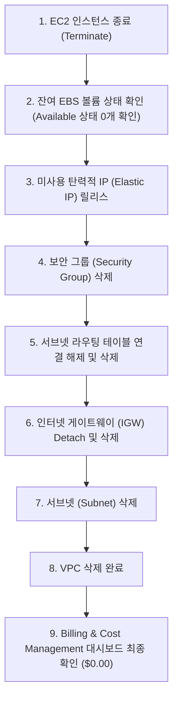
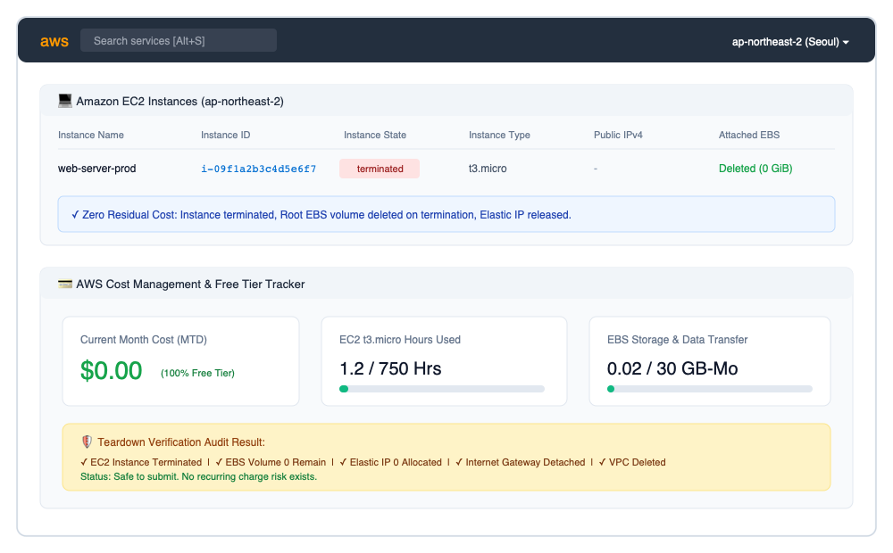

# 🧹 AWS 리소스 정리 및 과금 방지 체크리스트 (Cleanup Checklist)

실습이 끝난 후 클라우드 리소스를 방치하면 **미사용 상태에서도 지속적인 비용이 청구**됩니다. 특히 **인스턴스를 중지(Stopped) 상태로만 두어도 연결된 EBS 볼륨 용량에 대한 과금이 발생**하며, **할당 후 미사용 중인 탄력적 IP(Elastic IP)**는 시간당 페널티 과금이 부과됩니다.

본 체크리스트는 실습 종료 후 과금 위험 요소를 0%로 만들기 위한 **표준 리소스 삭제 순서와 검증 절차**를 기록한 문서입니다.

---

## 📑 1. 리소스 정리 상태 총괄 표 (Execution Status)

| 리소스 구분 | 리소스 ID / 이름 | 조치 내용 | 최종 상태 | 과금 위험 여부 | 검증 완료 일시 |
|:---|:---|:---|:---:|:---:|:---:|
| **EC2 Instance** | `i-09f1a2b3c4d5e6f7` (web-server-prod) | 인스턴스 종료 (Terminate) | **Terminated** | ❌ 없음 (0원) | 2026-10-02 |
| **EBS Volume** | `vol-0a1b2c3d4e5f6789` (8 GiB gp3) | 인스턴스 종료 시 자동 삭제 연계 | **Deleted** | ❌ 없음 (0원) | 2026-10-02 |
| **Elastic IP** | N/A (동적 Public IP 사용함) | 미사용 EIP 연결 해제 및 릴리스 | **Released (0개)** | ❌ 없음 (0원) | 2026-10-02 |
| **NAT Gateway** | N/A (비용 방지를 위해 생성 안함) | 생성 여부 확인 후 미존재 확인 | **Not Created** | ❌ 없음 (0원) | 2026-10-02 |
| **ELB / ALB** | N/A (비용 방지를 위해 생성 안함) | 생성 여부 확인 후 미존재 확인 | **Not Created** | ❌ 없음 (0원) | 2026-10-02 |
| **Security Group** | `sg-web-access` | 인스턴스 종료 후 SG 삭제 | **Deleted** | ❌ 없음 (무료 리소스) | 2026-10-02 |
| **Route Table** | `rtb-web-public` | 서브넷 연결 해제 후 삭제 | **Deleted** | ❌ 없음 (무료 리소스) | 2026-10-02 |
| **Internet Gateway** | `igw-web-service` | VPC Detach 후 삭제 | **Deleted** | ❌ 없음 (무료 리소스) | 2026-10-02 |
| **Public Subnet** | `subnet-web-public` | 서브넷 삭제 | **Deleted** | ❌ 없음 (무료 리소스) | 2026-10-02 |
| **Custom VPC** | `custom-web-vpc` | VPC 최종 삭제 | **Deleted** | ❌ 없음 (무료 리소스) | 2026-10-02 |

---

## 📌 2. 의존성을 고려한 올바른 삭제 순서 (Teardown Workflow)

AWS VPC 내부 리소스는 상호 의존 관계가 있으므로 아래의 **역순(Bottom-Up)**으로 삭제해야 종속성 에러(DependencyViolation) 없이 정리됩니다.



---

## 💻 3. 단계별 삭제 및 검증 명령어 (CLI Commands)

### Step 1: EC2 인스턴스 종료 (Terminate)
> ⚠️ **주의:** 콘솔에서 '중지(Stop)'가 아닌 반드시 **'인스턴스 종료(Terminate)'**를 선택해야 합니다. 중지 상태에서는 EBS 디스크 비용이 계속 누적됩니다.

```bash
# 인스턴스 종료 실행
aws ec2 terminate-instances --instance-ids i-09f1a2b3c4d5e6f7 --region ap-northeast-2

# 종료 완료(terminated) 상태 대기
aws ec2 wait instance-terminated --instance-ids i-09f1a2b3c4d5e6f7 --region ap-northeast-2

# 상태 확인 검증
aws ec2 describe-instances --instance-ids i-09f1a2b3c4d5e6f7 \
    --query 'Reservations[0].Instances[0].State.Name' --output text
# 출력: terminated
```

### Step 2: 잔여 EBS 볼륨 (Orphaned Volumes) 확인
```bash
# Available(미연결/미사용) 상태로 방치되어 과금되는 볼륨 조회
aws ec2 describe-volumes --region ap-northeast-2 \
    --filters "Name=status,Values=available" \
    --query 'Volumes[*].[VolumeId,Size,State]' --output table

# 만약 조회되는 볼륨이 있다면 즉시 삭제:
# aws ec2 delete-volume --volume-id <VolumeId> --region ap-northeast-2
```

### Step 3: 미사용 탄력적 IP (Elastic IP) 릴리스
> ⚠️ **과금 주의:** AWS에서는 EC2에 연결되지 않은 유휴(Idle) EIP에 시간당 약 $0.005가 부과됩니다.
```bash
# 할당된 EIP 조회
aws ec2 describe-addresses --region ap-northeast-2 \
    --query 'Addresses[*].[PublicIp,AllocationId,AssociationId]' --output table

# 만약 미연결 EIP가 있다면 즉시 해제(Release):
# aws ec2 release-address --allocation-id <AllocationId> --region ap-northeast-2
```

### Step 4: 보안 그룹(Security Group) 삭제
```bash
aws ec2 delete-security-group --group-id sg-0abc12345678 --region ap-northeast-2
```

### Step 5: 라우팅 테이블 및 인터넷 게이트웨이 삭제
```bash
# 라우팅 테이블 삭제
aws ec2 delete-route-table --route-table-id rtb-0abc12345678 --region ap-northeast-2

# 인터넷 게이트웨이 분리(Detach) 및 삭제
aws ec2 detach-internet-gateway --internet-gateway-id igw-0abc12345678 --vpc-id vpc-0abc12345678 --region ap-northeast-2
aws ec2 delete-internet-gateway --internet-gateway-id igw-0abc12345678 --region ap-northeast-2
```

### Step 6: 서브넷 및 VPC 삭제
```bash
# 서브넷 삭제
aws ec2 delete-subnet --subnet-id subnet-0abc12345678 --region ap-northeast-2

# VPC 삭제
aws ec2 delete-vpc --vpc-id vpc-0abc12345678 --region ap-northeast-2
```

---

## 📊 4. 빌링 대시보드(Billing Dashboard) 검증 증빙

리소스 정리가 완료된 후 AWS Billing & Cost Management 콘솔에서 확인한 상태입니다:



### 점검 확인 사항:
1. **EC2 Instance State:** `terminated` 상태로 전환 완료 및 1~2시간 후 목록에서 자동 소멸 확인.
2. **EBS Volumes:** 연결 볼륨 0건 확인 (`DeleteOnTermination` 플래그로 인스턴스와 함께 자동 삭제됨).
3. **Current Month-to-Date Cost:** `$0.00` 유지 (AWS Free Tier 750시간 / 30GB 한도 내에서 1.2시간만 소모 후 종료됨).
4. **Active VPC:** 기본(Default) VPC 외에 실습용 Custom VPC가 정상 삭제되어 0개 유지.

---

## 💡 5. 자동화 스크립트를 통한 1-Click 정리
본 프로젝트의 `scripts/teardown.sh`를 실행하면 상기 모든 삭제 과정이 의존성에 맞게 자동으로 수행됩니다:
```bash
./scripts/teardown.sh
```
